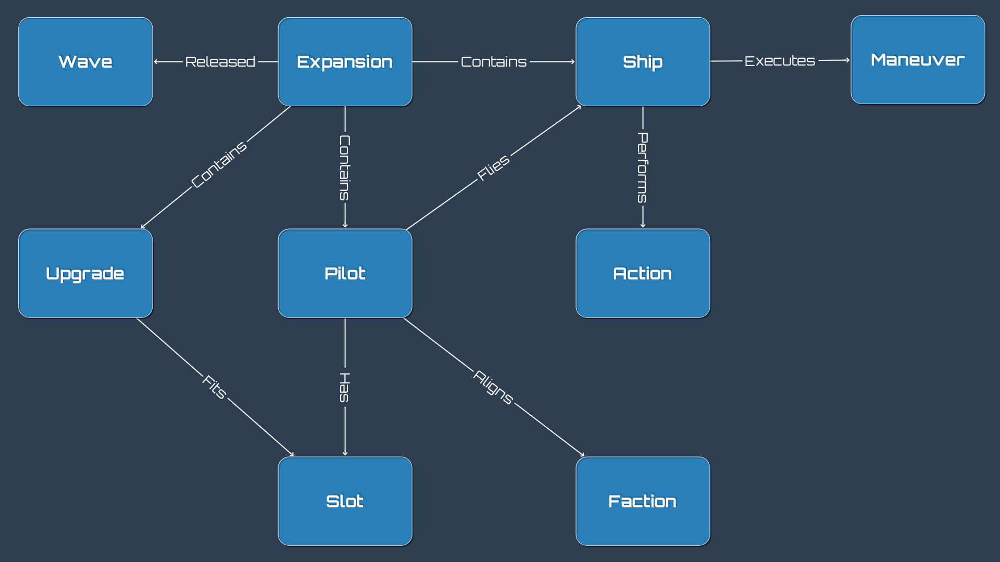

[](https://travis-ci.org/stevegood/tython)

# Tython
Backend application for Deep Core

# Data Model

The data model consists of two parts, the relationships graph, and the user data (collection, squads, etc).

## Relationships



## User Data

All things saved by users.

### Squad (WIP)

```json
{
  "_id": "595d591f82cfa10d304f1fcb",
  "owner": "stevegood",
  "faction": "scum",
  "name": "Worlds list",
  "points": 98,
  "pilots": [{
    "pilot": "595d591f82cfa10d304f1fcf",
    "upgrades": [
      "595d591f82cfa10d304f1fca",
      "595d591f82cfa10d304f1fcb"
    ]
  }, {
    "pilot": "595d591f82cfa10d304f1fcx",
    "upgrades": [
      "595d591f82cfa10d304f1fca",
      "595d591f82cfa10d304f1fcb"
    ]
  }]
}
```

### Collection (WIP)

```json
{
  "owner": "stevegood",
  "expansions": [
    "595d591f82cfa10d304f1fca",
    "595d591f82cfa10d304f1fcb",
    "595d591f82cfa10d304f1fcc",
    "595d591f82cfa10d304f1fcd",
    "595d591f82cfa10d304f1fce"
  ],
  "pilots": [
    "595d591f82cfa10d304f1fca",
    "595d591f82cfa10d304f1fcb",
    "595d591f82cfa10d304f1fcc",
    "595d591f82cfa10d304f1fcd",
    "595d591f82cfa10d304f1fce"
  ],
  "ships": [
    "595d591f82cfa10d304f1fca",
    "595d591f82cfa10d304f1fcb",
    "595d591f82cfa10d304f1fcc",
    "595d591f82cfa10d304f1fcd",
    "595d591f82cfa10d304f1fce"
  ],
  "upgrades": [
    "595d591f82cfa10d304f1fca",
    "595d591f82cfa10d304f1fcb",
    "595d591f82cfa10d304f1fcc",
    "595d591f82cfa10d304f1fcd",
    "595d591f82cfa10d304f1fce"
  ]
}
```

